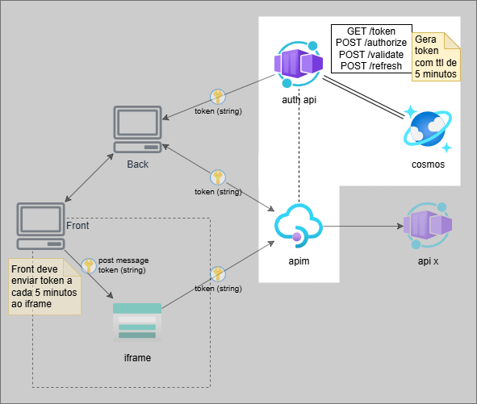
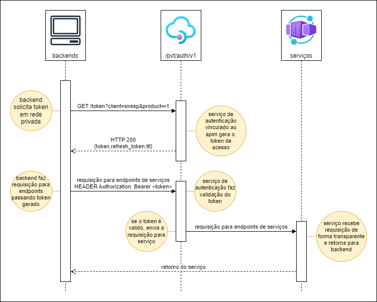
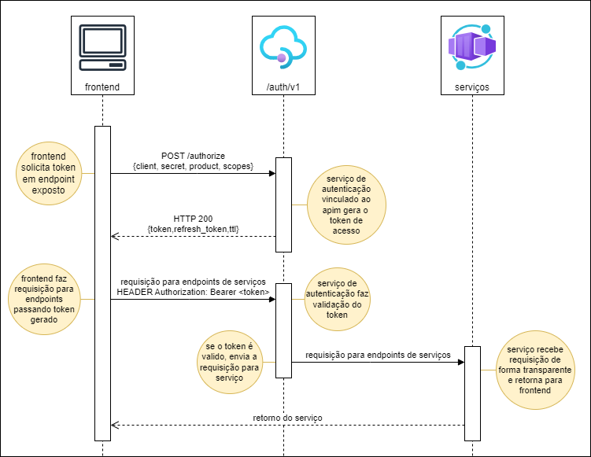
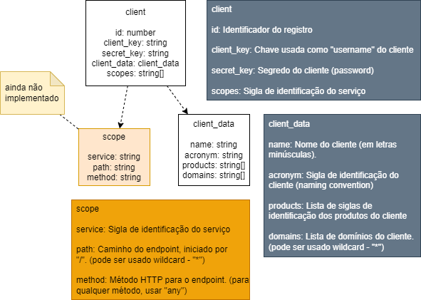
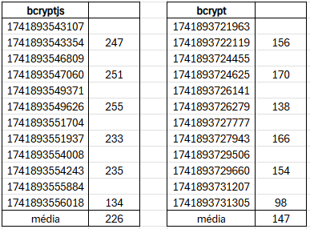

[[_TOC_]]

# Introdução

Serviço de autenticação e autorização de recursos.

# Arquitetura



1. Aplicações clientes fazem a solicitação do token passando um escopo;
2. Aplicações fazem chamada por um endpoint através do APIM usando token;
3. APIM faz validação do token recebido para o endpoint solicitado;
4. Em caso de sucesso, APIM entrega requisição para serviço.

# Casos de uso

## Acesso de backends (ambiente seguro)



## Acesso de frontend (ambiente não seguro)



# Database



# Run

Para rodar local, pode ser usado docker através dos comandos:

```bash
docker build -t auth .
docker run -p 80:80 -d --name service-auth auth
```

Ou diretamente com o npm através de um dos comandos:

```bash
  # Roda com nodemon para atualização automática
  npm run dev
  # Roda usando node para validações
  npm run start
```

# Endpoints

| Método | Endpoint   | Parâmetros                                                                 | Retorno                  | Descrição |
|--------|------------|----------------------------------------------------------------------------|--------------------------|-----------|
| GET    | /token     | **Query** [Identificação](#identificação)                                  | **Body** [Token](#token) | Obtém o token de acesso, endpoint fechado apenas para backends em rede segura |
| POST   | /authorize | **Body** [Identificação](#identificação)                                   | **Body** [Token](#token) | Obtém o token de acesso, endpoint aberto para ser usado por frontends |
| POST   | /refresh   | **Header** "Authorization: Bearer `refresh_token`"                         | **Body** [Token](#token) | Obtém o token de acesso à partir do refresh token |
| POST   | /validate  | **Header** "Authorization: Bearer `token`" <br> **Body** [Escopo](#escopo) | Cabeçalho HTTP           | Verifica token recebido e retorna status HTTP |

## Identificação

Objeto enviado para obtenção do token de acesso.

Os campos **secret** e **scopes** (escopo) são opcionais para o método `GET /token`.

```json
{
  "client": "String com sigla de identificação do cliente solicitando token. Ex: sir (Siresp)",
  "product": "String com sigla de identificação do produto solicitando token. Ex: r3",
  "secret": "String contendo chave (hash) de identificação do cliente/produto.",
  "scopes": [
    "Lista de strings que contém as siglas dos serviços que serão acessados com o token gerado.",
    "Ex: [\"api1\", \"api2\"]"
  ]
}
```

## Token

Objeto de retorno contendo token de acesso para a aplicação.

Status `warning` pode ser retornado com mensagem apenas de ponto de atenção.

```json
{
  "code": "Numérico com código HTTP de status (também enviado no cabeçalho)",
  "status": "String de status da requisição. Valores: \"error\", \"success\", \"warning\" ",
  "message": "String contendo mensagem de aviso (warning) ou erro (error)",
  "token": "String contendo hash para autorização de recursos",
  "refresh_token": "String contendo hash para atualizar token",
  "ttl": "Numérico que indica o tempo de vida (time to live) do token em segundos",
}
```

## Escopo

Objeto contendo escopo que está sendo acessado, juntamente com o token de acesso (por cabeçalho) para validação.

```json
{
  "client": "String com sigla de identificação do cliente",
  "product": "String com sigla de identificação do produto",
  "scope": "String que contém a sigla do serviço sendo acessado.",
  "endpoint": "(opcional) Objeto Endpoint contendo endpoint sendo acessando."
}
```

## Endpoint

Objeto passado no objeto escopo, para validação de acesso.

```json
{
  "path": "String contendo caminho do endpoint",
  "method": "String contendo método HTTP ou identificação de outro protocolo.",
}
```

# Segurança e Performance

Para segurança ao salvar o segredo, está sendo usado o algoritmo bcrypt.

No NodeJs há dois pacotes que disponibilizam o bcrypt, o [bcryptjs][bcryptjs] e o [node:bcrypt][bcrypt].

O pacote [node:bcrypt][bcrypt] usa algumas bibliotecas do sistema operacional escritas em c++ que ajudam na performance da execução do algoritmo, porém essas bibliotecas fazem com que o tamanho da imagem aumente em aproximadamente 421% (de 185Mb para 780Mb).

O pacote [bcryptjs][bcryptjs] roda totalmente com NodeJs, deixando a imagem mais leve e fazendo com que a aplicação inicie de forma mais rápida, porém a performance de execução é cerca de 30% abaixo em relação ao pacote node:bcrypt.



Pensando na escalabilidade e velocidade de inicialização dos containers, está sendo usado o pacote **bcryptjs**. Se houver percepção de degradação de performance que afete a operação, poderá ser substituído para o pacote **node:bcrypt**.

Para a substituição:

- Instale o pacote correto e desinstale o que não estiver sendo usado.
  - Ex: `npm install bcrypt && npm uninstall bcryptjs`.
- No arquivo `Dockerfile` faça as alterações pertinentes (linhas comentadas)
- No arquivo `crypt.services.js` faça as alterações pertinentes* (linhas comentadas).

\* _Não esquecer de comentar a linha do pacote que não estiver sendo utilizado._

# Referências

Framework:

- [ExpressJs 9.0.2][expressjs]
- [JWT 9.0.2][jsonwebtoken]
- [BcryptJs 3.0.2][bcryptjs]

Logger:

- [Pino 9.6.0][pino]

Testes:

- [Jest 29.7][jest]
- [Supertest 7.0.0][supertest]

<!-- Referencias -->

[bcrypt]: https://www.npmjs.com/package/bcrypt
[bcryptjs]: https://www.npmjs.com/package/bcryptjs
[expressjs]: https://expressjs.com/
[jest]: https://jestjs.io/docs/29.6/mock-functions
[jsonwebtoken]: https://www.npmjs.com/package/jsonwebtoken
[pino]: https://github.com/pinojs/pino
[supertest]: https://www.npmjs.com/package/supertest
